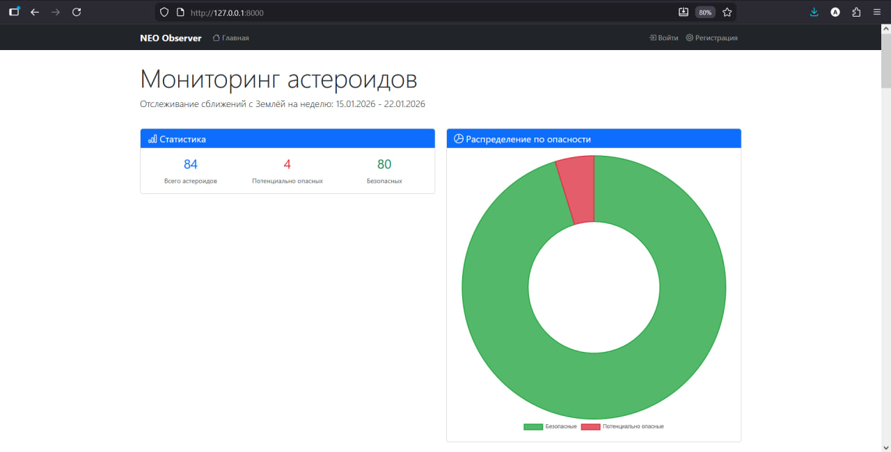
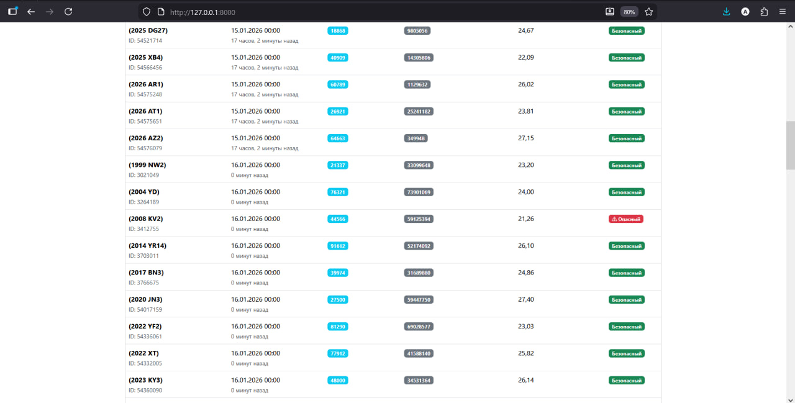

# NEO Observer

Информационно-аналитическая система мониторинга потенциально опасных астероидов на основе данных NASA. Сервис помогает астрономам-любителям отслеживать небесные тела, сближающиеся с Землей.

**Ссылка на рабочий проект:** 

## Технологии
* **Python 3.13**
* **Django 5.2**
* **NASA NeoWs API**
* **Bootstrap 5**
* **Chart.js**

## 📸 Скриншоты интерфейса

### 1. Главная страница (Dashboard)
Отображение списка астероидов на текущую неделю и статистика опасностей.


### 2. Таблица сближений
Детальная информация о скорости и дистанции пролета для каждого объекта.


### 3. Личный кабинет
Персональный список отслеживания с возможностью оставлять заметки.


## Как запустить проект локально
1. **Клонируйте репозиторий:**
   ```bash
   git clone https://github.com/ecl1pse192/asteroid_watch.git
2. **Создайте и активируйте виртуальное окружение:**
    ```bash
    python -m venv venv
    # Для Windows:
    venv\Scripts\activate
    # Для Mac/Linux:
    source venv/bin/activate
3. **Установите зависимости:**
    ```bash
    pip install -r requirements.txt
4. **Настройте переменные окружения:**
    Создайте файл .env в корне проекта (рядом с manage.py) и добавьте:
    ```bash
    NASA_API_KEY=DEMO_KEY
5. **Выполните миграции:**
    ```bash
    python manage.py migrate
6. **Загрузите данные**
    Команда скачает актуальные данные с серверов NASA:
    ```bash
    python manage.py load_nasa
7. **Запустите сервер:**
    ```bash
    python manage.py runserver